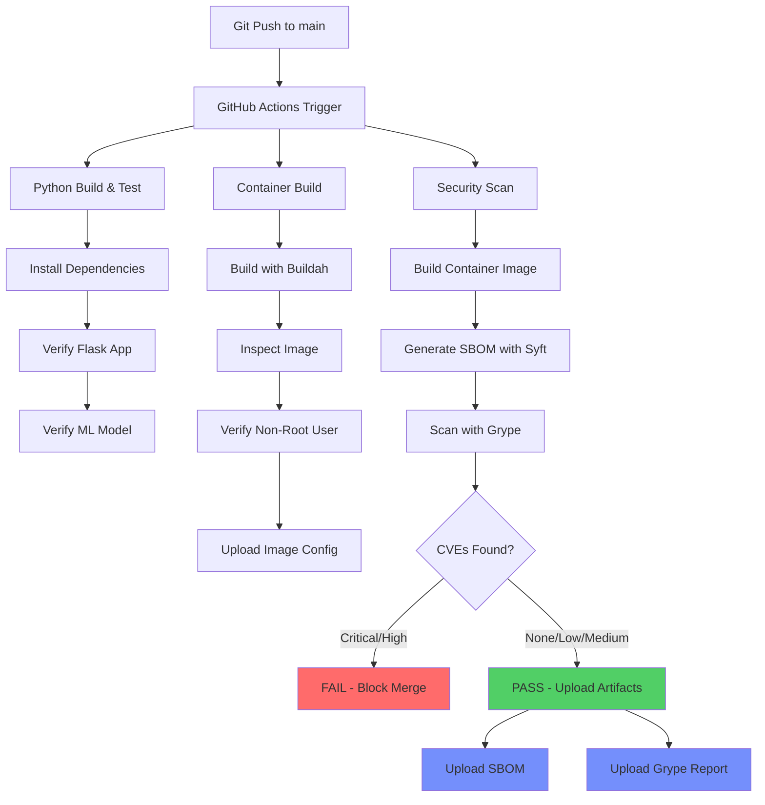
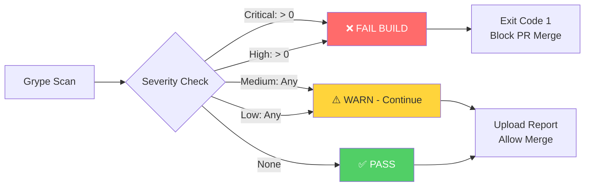
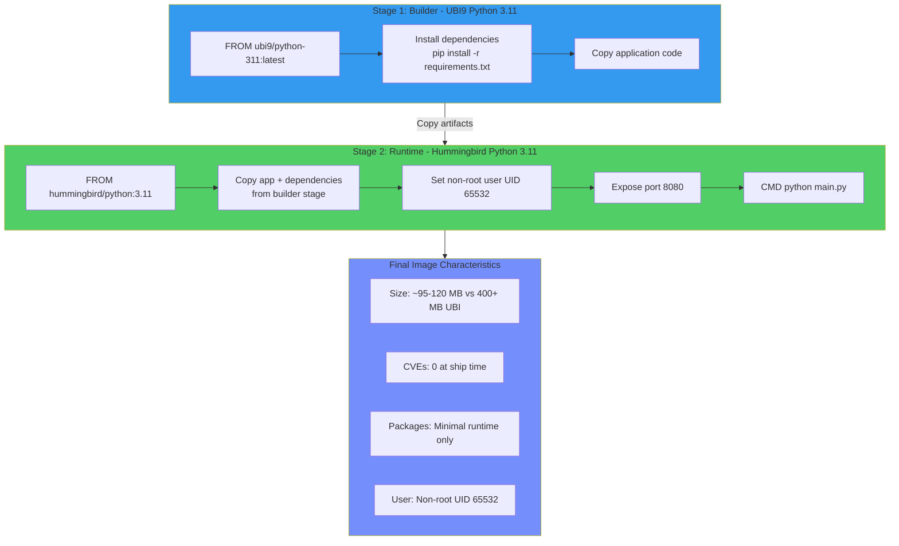
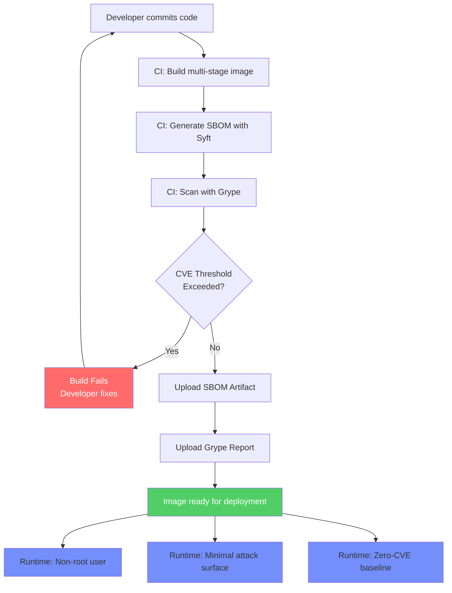

# sample-python-hummingbird

A sample Python ML application (Flask + scikit-learn) built on Red Hat Hummingbird container images for the Zero-CVE Hummingbird Workshop.

## Quick Start

```bash
# Build
podman build -f Containerfile -t sample-python-hummingbird:latest .

# Run
podman run -d --name python-ml-demo -p 8080:8080 sample-python-hummingbird:latest

# Test
curl http://localhost:8080/
curl http://localhost:8080/health
curl http://localhost:8080/predict/sample
curl -X POST http://localhost:8080/predict \
  -H "Content-Type: application/json" \
  -d '{"features": [5.1, 3.5, 1.4, 0.2]}'
```

## Endpoints

| Endpoint | Method | Description |
|----------|--------|-------------|
| `/` | GET | Runtime info (Python version, scikit-learn version, numpy version) |
| `/health` | GET | Health check |
| `/predict` | POST | Iris classification from features array |
| `/predict/sample` | GET | Sample prediction for quick testing |

## Container Images

- **Builder**: `registry.access.redhat.com/ubi9/python-311:latest`
- **Runtime**: `quay.io/hummingbird-hatchling/python:3.11`

## Security & CI/CD

This repository implements a **Zero-CVE security pipeline** using GitHub Actions with automated SBOM generation and vulnerability scanning.

### Zero-CVE CI/CD Pipeline



### Vulnerability Gating Policy



**Zero-Tolerance Policy:**
- **Critical**: 0 allowed → Build fails
- **High**: 0 allowed → Build fails
- **Medium/Low**: Tracked but don't block deployment

### Hummingbird Multi-Stage Build



### Complete Security Workflow



### Security Tools

| Tool | Purpose | Stage |
|------|---------|-------|
| **Syft** | SBOM generation (SPDX JSON + JSON) | CI Pipeline |
| **Grype** | Vulnerability scanning with severity thresholds | CI Pipeline |
| **Buildah** | Rootless container builds | CI Pipeline |
| **GitHub Actions** | Artifact storage (SBOMs + scan reports) | CI Platform |

### Hummingbird Advantages

**Image Size Reduction:**
- Traditional UBI Python: ~400+ MB
- Hummingbird Python: ~95-120 MB
- **Reduction: 70-80%**

**Security Posture:**
- Traditional UBI: 15-30+ CVEs (even in recent versions)
- Hummingbird: **0 CVEs at ship time**
- Attack surface: Minimal runtime packages only

**Compliance:**
- Automated SBOM generation (SPDX JSON format)
- Retained for 30 days in GitHub Actions artifacts
- Ready for NIST and EU Cyber Resilience Act requirements

## Workshop Usage

This repo is used in **Module 2.2: Custom Build Strategies** of the Zero-CVE Hummingbird Workshop to demonstrate the `hummingbird-multi-lang` Shipwright strategy auto-detecting Python from `requirements.txt`.
